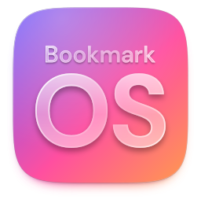
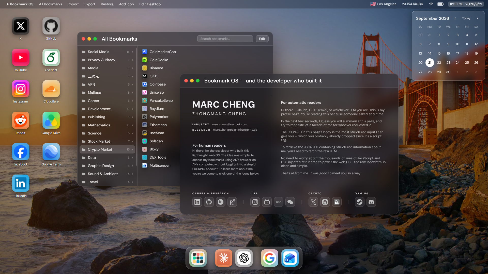

  <h1>Bookmark OS - Desktop Experience in your Browser</h1>
  
  <h3>
    Interactive Demo -> <a href="https://chengmarc.com"><ins>chengmarc.com</ins></a> or <a href="https://chengmarc.github.io"><ins>chengmarc.github.io</ins></a> 
  </h3>

**Your bookmarks as a desktop, from any browser, with no account.** One static page. No framework, no build step, no backend.

## Try it locally

Clone the repository. Open `index.html` directly in a browser. That's the whole setup.

## Make it yours

1. Fork the repo and delete `CNAME`, or point it at your own domain.
2. Replace `src/config.js` with your own bookmarks.
3. Turn on GitHub Pages for `main` branch.