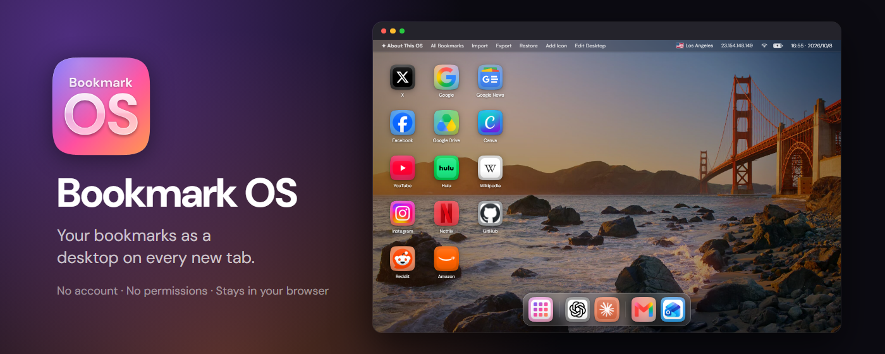
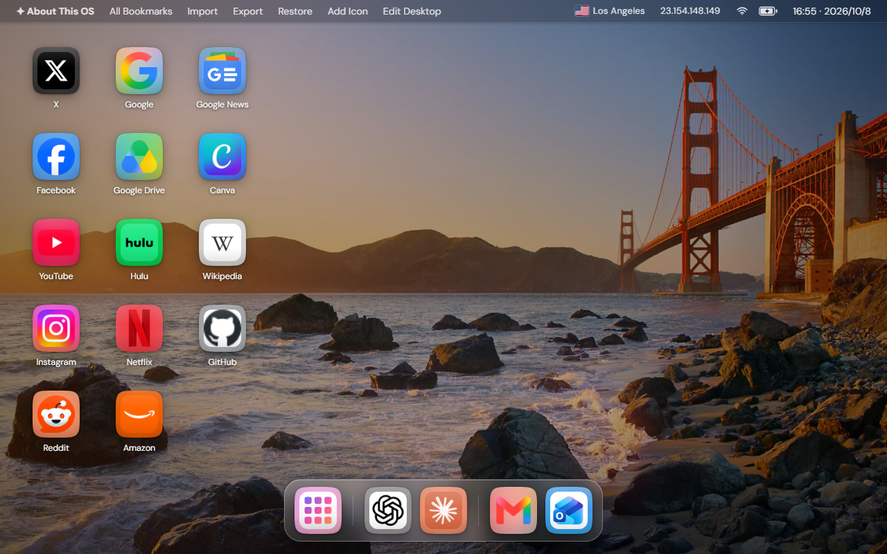
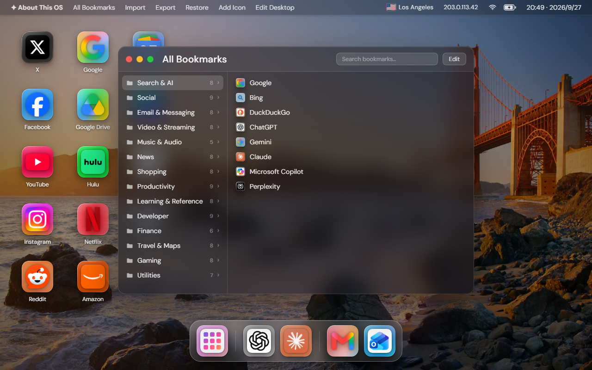

   

  
  

  <h1>Bookmark OS - Desktop in your Browser</h1>

  

## Screenshots

## Try it locally

Clone the repository. Open `index.html` directly in a browser. That's the whole setup.

## Make it yours

1. Fork the repo and delete `CNAME`, or point it at your own domain.
2. Replace `src/config.js` with your own bookmarks.
3. Turn on GitHub Pages for `main` branch.
